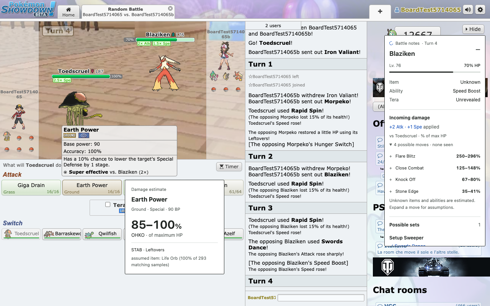

# PS Randbats Assistant

A compact whiteboard-style sidebar for **Gen 9 Random Battles** on [Pokémon Showdown](https://play.pokemonshowdown.com/).

- Outgoing damage estimates when you hover or keyboard-focus your move buttons.
- Incoming damage from revealed and possible opposing moves, with visible stat boosts.
- Revealed items, abilities, Tera types, and possible set tracking.
- Item assumptions based on 20,000 sampled Showdown teams, narrowed by revealed moves.
- A 264px sidebar with a scrollable body, collapse control, and collapsed default on narrow screens.

All calculations run locally. No analytics, extension account, or remote executable code.



**Latest: 1.0.1** fixes the missing sidebar in battles with suffixed room IDs. [Changelog](docs/CHANGELOG.md).

## Test locally — no build needed

1. Download this repository using **Code → Download ZIP**, then extract it (or clone it).
2. Open `chrome://extensions` in Chrome.
3. Enable **Developer mode**.
4. Click **Load unpacked** and select the repository's **`dist` folder**. Select the folder itself, not a ZIP or the repository root.
5. Disable any older installed copy to avoid duplicate overlays.
6. Reload Showdown and start a new **Gen 9 Random Battle**.

The checked-in [dist folder](dist/) is the built extension. You can also extract the [release ZIP](release/ps-randbats-assistant-1.0.1.zip) into its own folder and load that folder unpacked.

After downloading a newer build, click **Reload** on the extension's Chrome card, refresh Showdown, and start a fresh battle. This is a release candidate for local testing; it has not been submitted to the Chrome Web Store.

## Supported scope and limitations

Supports singles Gen 9 Random Battles on `play.pokemonshowdown.com`. Other formats, custom servers, replays, and spectator-only battles are outside this release's scope.

Damage estimates are approximate. Unknown items and abilities are assumptions, not revealed facts. Sample frequencies are not exact live-server probabilities. Some unusual mechanics, including Transform, Substitute, and ability suppression, are not fully modeled. See [release limitations](docs/RELEASE.md) and [item research](docs/ITEM_RESEARCH.md).

## Development

Use Node.js 22.12+ or Node.js 24 and npm.

```sh
git clone https://github.com/bagel786/ps-randbats-ext.git
cd ps-randbats-ext
npm ci
npm run typecheck
npm test
npm run build
```

`npm run dev` rebuilds the extension when source changes. Reload it in Chrome after rebuilding. Builds use the committed dataset and do not silently fetch new sets.

### Browser checks

```sh
npx playwright install chromium
npm run build
npm run test:integration
```

For visual UI checks, start the preview server in one terminal:

```sh
npx vite --host 127.0.0.1
```

Visit `http://127.0.0.1:5173/preview/`, or run `npm run test:ui` in another terminal. The preview is explicitly illustrative; it is not shipped inside the extension.

### Build the release candidate

```sh
npm run release
```

This checks types, runs regression tests, builds the extension, tests the built scripts in Chromium, validates the package, and writes `release/ps-randbats-assistant-1.0.1.zip`. Playwright Chromium must be installed first. Commit updated `dist/` and `release/` alongside source changes so the no-build download stays current.

## Documentation

- [Documentation index](docs/README.md)
- [Release and submission checklist](docs/RELEASE.md)
- [Official-server smoke test](docs/LIVE_SMOKE.md)
- [Validation and regression coverage](docs/VALIDATION.md)
- [Item-selection research](docs/ITEM_RESEARCH.md)
- [Privacy policy](docs/PRIVACY.md)
- [Store listing draft](docs/STORE_LISTING.md)
- [Maintainer scripts](scripts/README.md)
- [Screenshots and store assets](artifacts/README.md)

## Credits

Uses [@smogon/calc](https://github.com/smogon/damage-calc), [Pokémon Showdown](https://github.com/smogon/pokemon-showdown) random-battle data, and React. Third-party notices are included in [public/THIRD_PARTY_NOTICES.txt](public/THIRD_PARTY_NOTICES.txt) and the release package.

Independent fan project; not affiliated with Pokémon, Nintendo, Game Freak, The Pokémon Company, or Pokémon Showdown.
